## DAY01

SQL select 语句禁止使用 *，减少工作量；

##### 1.SQL 思考：


​    A) BETWEEN AND 对比 <= and >=

等价，据说 <= and >= 效率更高。

​    B) ORDER BY 执行时机

ORDER BY 在最后执行。

​    C) ORDER BY 多列顺序对结果影响

ORDER BY 后面多列的顺序不同，结果不同。

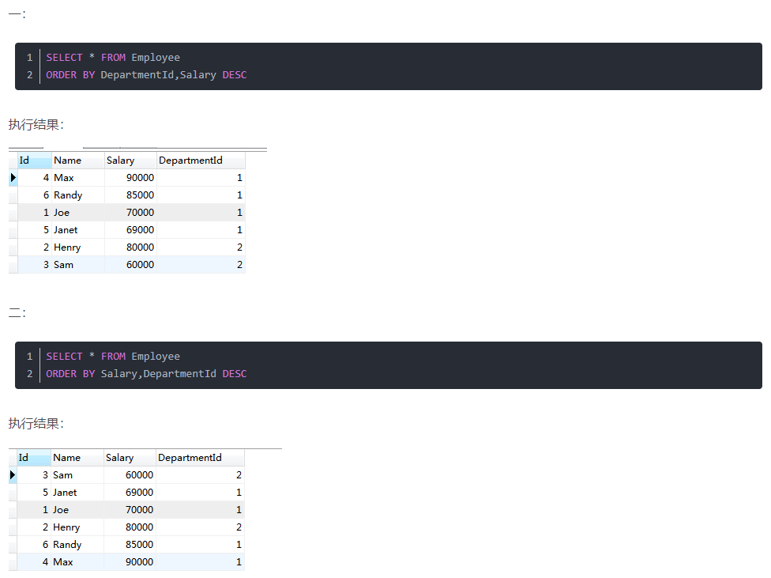

##### 2.现在都有那些数据库，每种数据库的区别、应用场景、优点是什么

 eg: 关系型、文档型、内存型、分布式....
     Mysql Oracle 达梦 Hbase...

1. Oracle ：关系型数据库，适合吞吐量高的数据库方案，效率高、可靠性好、可移植性好、安全性高、性能高、完全向下兼容。
2. SQL Server ：关系型数据库，主要应用于大型管理系统，与微软的 Windows 系列操作系统的兼容性很好，支持 Windows 图形化管理工具，支持本地和远程的系统管理和配置；强壮的事务处理功能；支持对称多处理器结构、存储结构、ODBC，并由自主的 SQL 语言。
3. MySQL ：关系型数据库，性能卓越服务稳定、开源、软件体积小、提供多种 API，支持多种开发语言。
4. 达梦：关系型数据库，在保证大型通用的基础上，针对可靠性、高性能、海量数据处理和安全性做了大量的研发和改进工作，极大提升产品的性能、可靠性、可扩展性。
5. Access：小型关系型数据库，存储方式简单，易于维护管理；面向对象的开发工具；易于扩展。
6. Redis、Memcached、MemcacheDB：键值存储数据库，高性能和扩展性，易部署，高并发。
7. Cassandra、HBase：列存储数据库，常用于应对分布式存储海量数据。
8. MongoDB、CouchDB：面向文档数据库，可以看作键值数据库的升级版，且查询效率更高。
9. Neo4J、InforGrid：图形数据库，将数据以图的方式存储。

##### 3.了解Mysql SQL解析器、存储结构、索引结构相关知识

1. SQL 解析主要包含：词法分析、语义语法分析、优化和执行代码生成。

   [MySQL - MySQL中SQL是如何解析的 | Java 全栈知识体系 (pdai.tech)](https://pdai.tech/md/db/sql-mysql/sql-mysql-sql-parser.html#sql解析的原理)

2. MySQL 常用的存储引擎 InnoDB 采用的是 B+Tree。

3. MySQL 索引的数据结构是树。[mysql索引的数据结构是什么-mysql教程-PHP中文网](https://www.php.cn/mysql-tutorials-422645.html#:~:text=mysql索引的,是B%2BTree。)

##### 4.DML/DDL/DCL：基础用法掌握。

​    eg: 给用户A添加数据库B中的表C的查询权限，DCL语句该怎么写？

```mysql
grant select on B.C to 'A'@'%';
```

##### 5.基础查询部分：

​    思考题：一条SQL查询语句是如何执行的
​    问题：如果表 T 中没有字段 k，而你执行了这个语句 select * from T where k=1, 
​     那肯定是会报“不存在这个列”的错误： “Unknown column ‘k’ in ‘where clause’”
​     这个错误是在上面提到的哪个阶段报出来的呢？

[一条SQL查询语句是如何执行的？](https://www.cnblogs.com/wupeixuan/p/11626024.html)

1. 在查询 SQL 语句前，先建立与 MySQL 的连接，由连接器来完成的。连接器负责跟客户端建立连接、获取权限、维持和管理连接。
2. 建立连接后开始执行 select 语句，首先会查询缓存看是否执行过这条语句。MySQL 8.0 版本将查询缓存的功能删除了。
3. 查询缓存未命中就开始对 SQL 语句进行解析。分析器先会做词法分析，识别出关键字、表名、列名他，再做语法分析。根据词法分析的结果，语法分析器会根据语法规则，判断输入的 SQL 语句是否满足 MySQL 语法。
4. 经过分析器的词法分析和语法分析后，还要经过优化器的处理，选择使用执行效率高的方案。
5. 执行器执行语句。

##### 6.MySQL常用函数学习

[MySQL函数大全](http://c.biancheng.net/mysql/function/)

## DAY02

##### 1. 去重复查询

- DISTINCT 关键字

  根据单个字段去重（精确去重）；

  ```mysql
  SELECT DISTINCT DEPARTMENT_ID
  FROM employees;
  ```

  若作用在多个字段，只有当这几个字段的值完全相同时，才能去重；

  只能放在 SQL 语句中的第一个字段前（SELECT 之后）才会起作用。

- GROUP BY 

  按照指定的规则对数据进行分组，然后针对若干个组进行数据处理；

  多个字段时，若要针对单字段去重，采用 GROUP BY 聚合去重；

  **注意**：不可以在 WHERE 子句中用聚合函数进行计算；使用 GROUP BY 分组后，如果要加聚合函数限制条件，则在 GROUP BY 后面用 HAVING 做限制。

  ```mysql
  SELECT JOB_ID, DEPARTMENT_ID
  FROM employees
  GROUP BY DEPARTMENT_ID;
  ```

- 比较

  两者都可以去重，DISTINCT 针对全部字段去重，GROUP BY 可以针对全部字段的某一字段去重；

  两者执行方式不同，DISTINCT 主要对数据两两进行比较，需要遍历整个表；GROUP BY 分组类似先建立索引再查询，数据量较大时，GROUP BY 速度较优。

##### 2. 模糊查询 LIKE/NOT LIKE

一般模糊查询语句语法：

```mysql
SELECT 字段 FROM 表 WHERE 字段 LIKE 条件;
```

关于条件，有四种匹配模式：

- ‘ % ’：表示任意0个或多个字符
- ‘ _ '：表示任意单个字符
- ’ [] '：表示括号内所列字符中的**一个**，指定字符、字符串或范围，要求匹配它们中的任一个
- ‘ [^] '：表示不在括号内的单个字符，要求匹配除指定字符外的任一个字符

##### 3. IN/EXISTS

- IN：确定给定的值是否与子查询或列表中的值相匹配，相当于多个 OR 条件的叠加；IN 在查询时，首先查询内表，子查询返回结果必须只有一个字段；

  ```mysql
  SELECT *
  FROM A
  WHERE id IN( SELECT id FROM B );
  #IN 只执行一次，它查出B表中的所有id字段并缓存起来。之后检查A表的id是否与B表中的id相等，如果相等则将A表的记录加入结果集中，直到遍历完A表的所有记录
  ```

- EXISTS：指定一个子查询，遍历循环外表，看外表中的记录有没有和内表的数据一样的；EXISTS 在查询时，首先查询主表，再判断条件；

  ```mysql
  SELECT a.*
  FROM A a
  WHERE exists(select * from B b where a.id=b.id)
  ```

- 比较：执行结果一样，执行流程不一样；IN 适合外表大、内表小的情况；EXISTS 相反。

- NOT IN：内外表都进行全表扫描，没有用到索引；

- NOT EXISTS：子查询依然能用到表上的索引，速度比 NOT IN 快。

##### 4. 函数

| 函数                        | 说明                                                         |
| --------------------------- | ------------------------------------------------------------ |
| LOCATE(substr,str)          | 返回字串符 substr 在字符串 str 第一个出现的位置              |
| LOCATE(substr,str,pos)      | 返回字符串 substr 在字符串 str 位置 pos 处开始第一次出现的位置，返回值为0，则 substr 不包含在 str 中 |
| SUBSTRING(string,position)  | 返回从位置 position 开始的截取 string 到最后                 |
| SUBSTRING(str,pos,len)      | 返回从位置 pos 开始的子字符串的字符数                        |
| INSTR()                     | 返回要截取的字符串在源字符串中的位置                         |
| DATEDIFF()                  | 返回两个日期之间的差                                         |
| SIGN(X)                     | X 为0，返回0；X 为正数，返回1；X 为负数，返回-1              |
| LAST_DAY()                  | 返回该月的最后一天对应的值                                   |
| INTERVAL()                  | 作为函数表示比较；作为关键字表示时间间隔，用于时间的加减     |
| DATE_FORMAT(date,format)    | 根据 format 字符串格式化 date 值                             |
| TRUNCATE 关键字             | 清空表，截断表                                               |
| DUAL                        | 虚拟表，这张表有且只能有一条数据                             |
| COALESCE(value1,value2,...) | 返回第一个非 NULL 参数                                       |

###### ROLLUP

ROLLUP 是 GROUP BY 子句的扩展，在 GROUP 分组字段的基础上再进行统计数据。允许包含表示小计的额外行（超级聚合行），以及总计行。通过 ROLLUP，可以使用单个查询生成多个分组集，分组集是一组用于分组的列。

基本语法：

```mysql
SELECT c1, c2, aggregate_function(c3)
FROM table
GROUP BY c1, c2 WITH ROLLUP;
```

在上面的语法中，ROLLUP(c1，c2)生成以下三个分组集：

```sql
(c1,c2)
(c1)
()
```

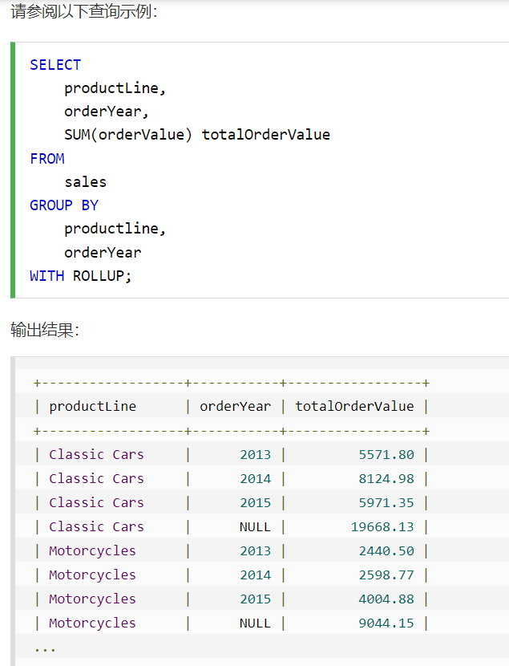

##### 5. 条件判断语句

- CASE()

  ```mysql
  CASE expr
  WHEN v1 THEN r1
  [WHEN v2 THEN r2]
  [ELSE rn]
  END
  #如果 expr 值等于某个 vn，则返回对应位置 THEN 后面的结果；如果与所有值都不相等，则返回 ELSE 后面的 rn。
  ```

- IF(expr , v1 , v2)

  如果表达式 expr 的值为 TURE ，则IF()的返回值为v1；如果表达式 expr 是值为 FALSE，则 IF() 的返回值为 v2。

## DAY03

##### 1. 全连接 UNION

> MySQL 已经没有全连接了，有的教程上还写着 FULL JOIN 但是实现不了，不过可以换一种方式来查询：

```mysql
(SELECT *
 FROM a
 LEFT JOIN b
 ON a.id = b.id )
 UNION
(SELECT *
 FROM a
 RIGHT JOIN b
 ON a.id = b.id );
```

用于把来自多个 SELECT 语句的结果组合到一个结果集合中。

```mysql
(SELECT column,... FROM table1) 
UNION [ALL]
(SELECT column,... FROM table2)
```

- 通过 UNION 连接的 SQL 分别单独取出的字段数必须相同，否则报错。

##### 2. 内连接查询 INNER JOIN

JOIN 等价于 INNER JOIN ，返回两张表的交集，内连接分为隐式和显式，结果一样。

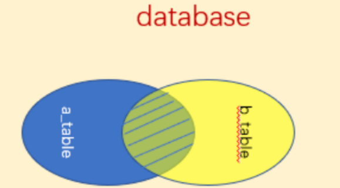

```mysql
#隐式内连接
SELECT *
FROM a, b
WHERE a.id = b.id;

#显式内连接
SELECT *
FROM a
INNER JOIN b
ON a.id = b.id;
```

> 适用场景：连接的两表必须在某字段上有相等的值才可以将整条记录显示出来。

> 如一条服务单记录在了两个表中，A 表中记录了该服务单的服务时间、坐席名称和录音地址等基本信息，B 表中记录了该服务单的业务详情，如保险单号，车牌号，保单日期等，当显示该服务单时，要将 A 表与 B 表做内连接，因为少这两表任何一个表，该服务单都不算完整。

##### 3. 外连接查询

分为左连接和右连接，两者相似。

> 适用场景：如员工表 A 中某字段是详细地址信息表 B 的主键 id，这两个表相关联时，就可以用左连接或右连接。因为在详细地址信息表中找不到某员工的地址信息也要将员工这条记录显示出来，相应的详细地址信息字段为空即可，不能因为地址没有存在数据库里，这个员工就没了（简单理解成不重要的信息不影响整条记录的显示）。

###### 左连接查询 LEFT JOIN / LEFT OUTER JOIN

左（外）连接，左表（a_table）的记录将会全部表示出来，右表（b_table）只会显示符合 ON 内搜索条件的记录，且右表记录不足的地方均为 NULL。

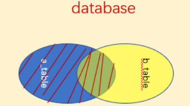

```mysql
SELECT *
FROM a
LEFT JOIN b
ON a.id = b.id;
```

###### 右连接查询 RIGHT JOIN / RIGHT OUTER JOIN

与左（外）连接相反，右（外）连接，左表（a_table）只会显示符合搜索条件的记录，而右表（b_table）的记录将会全部表示出来，且左表记录不足的地方均为 NULL。

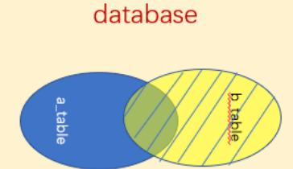

```mysql
SELECT *
FROM a
RIGHT JOIN b
ON a.id = b.id;
```

##### 4. 交叉连接

查询两张表的乘积

```mysql
SELECT *
FROM A,B;
```

##### 5. SQL 语句执行顺序

在 SQL 语句中每个关键字都会按照顺序往下执行，每一步操作就会更新生成一个**虚拟表**，最后的虚拟表就是返回的最终结果。

> (8) SELECT (9)DISTINCT <select_list>
> (1) FROM <left_table>
> (3) <join_type> JOIN <right_table>
> (2) ON <join_condition>
> (4) WHERE <where_condition>
> (5) GROUP BY <group_by_list>
> (6) WITH{CUBE|ROLLUP}
> (7) HAVING <having_condition>
> (10) ORDER BY <order_by_list>
> (11) LIMIT <limit_number>

1. FROM ：对 FROM 左边的表和右边的表计算笛卡尔积，产生虚表 VT1；
2. ON ：对虚拟表 VT1 进行 ON 条件限制筛选，只有符合限制条件的行数据才会被记录在虚拟表 VT2 中；
3. JOIN ：如果是 OUT JOIN，那么将保留表中（如左表或者右表）未匹配的行作为外部行添加到虚拟表 VT2 中，从而产生虚拟表 VT3；
4. WHERE ：对虚拟表 VT3 进行 WHERE 条件过滤，只有符合的记录才会被放入到虚拟表 VT4；
5. GROUP BY ：根据 GROUP BY 子句中的字段，对虚拟表 VT4 进行分组操作，产生虚拟表 VT5；
6. CUBE|ROLLUP ：对虚拟表 VT5 进行 CUBE 或者 ROLLUP 操作，产生虚拟表 VT6；
7. HAVING ：对虚拟表 VT6 进行 HAVING 条件过滤，只有符合的记录才会被插入到虚拟表 VT7 中；
8. SELECT ：执行 SELECT 操作，选择指定的列，插入到虚拟表 VT8 中；
9. DISTINCT ：对虚拟表 VT8 中的记录进行去重，产生虚拟表 VT9；
10. ORDER BY ：将虚拟表 VT9 中的记录按照进行排序操作，产生虚拟表 VT10；
11. LIMIT ：取出指定行的记录，产生虚拟表 VT11，并将结果返回作为最终结果。

##### 6. 子查询/内查询/嵌套查询

是嵌套在其他 SQL 查询的 WHERE 子句中的查询，用于为主查询返回其所需数据，或者对检索数据进行进一步的限制。

规则：

- 子查询语句必须在圆括号内
- 子查询的 SELECT 语句中只能有一个字段，除非主查询中有多个字段，用于与子查询选中的字段相比较
- 子查询不能使用 ORDER BY，主查询可以；在子查询中，GROUP BY 起到 ORDER BY 相同的作用
- 返回多行数据的子查询只能同多值操作符一起使用，比如 IN 操作符
- 子查询不能直接用在聚合函数中
- BETWEEN 不能同子查询一起使用，但是 BETWEEN 操作符可以用在子查询中

子查询可以返回的数据类型：

- 单行单列：返回一个具体的字段的值（单值数据）
- 单行多列：返回一行数据中多个字段的内容
- 多行单列：返回同一字段的多行数据，相当于返回一组范围
- 多行多列：返回一张临时表

子查询可以嵌套在 FROM、WHERE、HAVING 子句中。

子查询运算符：

- 单行运算符：>、<、=、<>、>=、<=
- 多行运算符：IN（表示其中等值的数据）、ANY（其中之一）、ALL（所有）

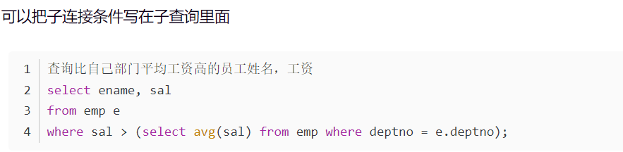

###### 在 WHERE 子句中使用子查询

在 WHERE 子句之中处理单行单列、多行单列、单行多列子查询。

- 单行单列

  ```mysql
  #查询基本工资高于公司平均薪金的全部雇员信息
  SELECT *
  FROM emp e
  WHERE e.sal > (
  	SELECT AVG( sal )
  	FROM emp);
  ```

- 单行多列

  ```mysql
  #查询与雇员7566从事同一工作且领导相同的全部雇员信息
  SELECT *
  FROM emp e
  WHERE (e.job,e.mgr) = (
          SELECT job,mgr
          FROM emp
       	WHERE empno = 7566);
  ```

- 多行单列

  主要使用 IN、ANY、ALL 操作符

  IN：

  ```mysql
  #查询出与每个部门中最低工资相同的全部雇员信息
  SELECT *
  FROM emp e
  WHERE e.sal IN (
  	SELECT MIN( sal )
  	FROM emp
  	GROUP BY deptno);
  ```

  ANY 有三种使用形式

  = ANY：与子查询返回结果的每个结果进行比较，功能与 IN 类似

  ```mysql
  #查询出每个部门经理的工资？每个部门经理的最低工资
  SELECT * 
  FROM emp 
  WHERE sal = ANY (
  	SELECT MIN (sal)
      FROM emp
      WHERE job = 'MANAGER'
      GROUP BY deptno);
  ```

  \> ANY：大于子查询返回结果的最小值，包含 \>= ANY

  ```mysql
  #查询出每个部门大于经理的工资
  SELECT * 
  FROM emp 
  WHERE sal > ANY (
  	SELECT MIN (sal)
      FROM emp
      WHERE job = 'MANAGER'
      GROUP BY deptno);
  ```

  \< ANY：小于子查询返回结果的最大值，包含\<= ANY

  ```mysql
  #查询出每个部门小于经理的工资
  SELECT * 
  FROM emp 
  WHERE sal < ANY (
  	SELECT MIN (sal)
  	FROM emp
  	WHERE job = 'MANAGER'
  	GROUP BY deptno);
  ```

  ALL 有三种使用形式

  \<> ALL：等价于 NOT IN ，= ALL 不等价于 IN

  ```mysql
  #查询出每个部门不等于经理的工资
  SELECT * 
  FROM emp 
  WHERE sal <> ALL (
      SELECT MIN (sal)
      FROM emp
      WHERE job = 'MANAGER'
  	GROUP BY deptno);
  ```

  \> ALL：大于子查询返回结果的最大值，包含 \>= ALL

  ```mysql
  SELECT * 
  FROM emp 
  WHERE sal > ALL (
      SELECT MIN (sal)
  	FROM emp
      WHERE job = 'MANAGER'
      GROUP BY deptno);
  ```

  \< ALL：小于子查询返回结果的最小值，包含 \<= ALL

  ```mysql
  SELECT * 
  FROM emp 
  WHERE sal < ALL (
  	SELECT MIN (sal)
      FROM emp
      WHERE job = 'MANAGER'
      GROUP BY deptno);
  ```


##### 7. WHERE / HAVING / ON

了解 SQL 执行顺序：序号代表 SQL 在运行时，数据库底层的先后顺序。

> (**8**)SELECT (**9**)DISTINCT (**11**)<Top Num> <select list>
> (**1**)FROM [left_table]
> (**3**)<join_type> JOIN <right_table>
> (**2**) ON <join_condition>
> (**4**)WHERE <where_condition>
> (**5**)GROUP BY <group_by_list>
> (**6**)WITH <CUBE | RollUP>
> (**7**)HAVING <having_condition>
> (**10**)ORDER BY <order_by_list>

- WHERE、HAVING

  **WHERE 在 GROUP BY 之前执行，所以 WHERE 的后面不能使用聚合函数过滤数据，只能使用 FROM 表里的字段来进行数据过滤；**

  **HAVING 在 GROUP BY 之后执行，HAVING 执行时数据已经完成分组了，可以使用聚合函数来进行数据的分组过滤。**

- WHERE、ON

  1. 功能区别：ON 支持左右连接，WHERE 只支持内连接；
  2. 性能区别：所有的查询都会产生一个中间临时表，返回的查询结果就是从临时表中得到的。ON 和 WHERE 后面所跟限制条件的区别，主要与限制条件**起作用的时机**有关。ON 根据限制条件对数据库记录进行过滤，然后生产临时表；而 WHERE 是在临时表生产之后，根据限制条件从临时表中筛选结果。因为 ON 限制条件发生时间较早，临时表的数据集要小，因此 ON 的性能要优于 WHERE。但这通常是在数据量比较大的时候才比较明显，如果数据量都比较小，这两个在使用上没有太大区别。

  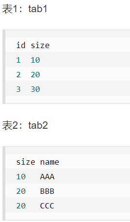

  ```mysql
SELECT * 
  FROM tab1 
  LEFT JOIN tab2 ON tab1.size = tab2.size 
  WHERE tab2.name = 'AAA';
  
  SELECT * 
  FROM tab1 
  LEFT JOIN tab2 ON tab1.size = tab2.size 
  AND tab2.name = 'AAA';
  ```
  
  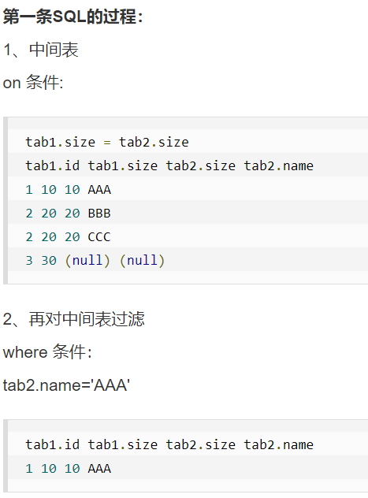

  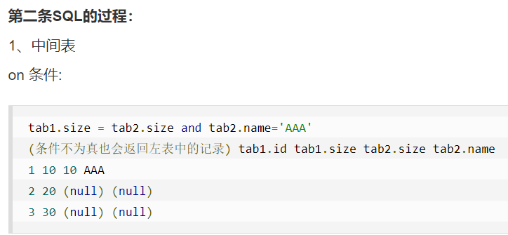

- 不论是内连接还是外连接，凡是不符合 WHERE 中的过滤条件的记录都不会被加到最后的结果集。
- 对于外连接的驱动表的记录来说，如果无法在被驱动表中找到匹配 ON 子句中过滤条件的记录，该记录仍然会被加到结果集中，对应的被驱动表记录的各个字段使用 NULL 值填充。
- 内连接中的 WHERE 句和 ON 子句是等价的。
- LEFT JOIN WHERE + 基表过滤条件：先对基表执行过滤，再进行 LEFT JOIN；
- LEFT JOIN WHERE + 被关联表过滤条件：先执行 LEFT JOIN，然后执行过滤条件；
- LEFT JOIN ON + 基表过滤条件：满足过滤条件的 LEFT JOIN，不满足的后面补 NULL，然后两集合并一起；
- LEFT JOIN ON + 被关联表过滤条件：先执行过滤条件，然后执行 LEFT JOIN ON；
- [WHERE / ON 多表连接例子](https://blog.csdn.net/weixin_43888806/article/details/100057911)

##### 8. IN / EXISTS

```mysql
#验证EXISTS结构
SELECT * 
FROM emp
WHERE EXISTS(   --返回空值，没有内容输出
	SELECT *
    FROM emp
    WHERE empno=9999); --没有这个编号的员工
    
SELECT * 
FROM emp
WHERE EXISTS(SELECT * FROM emp);--有内容将返回数据

SELECT * 
FROM emp
WHERE NOT EXISTS(SELECT * FROM emp);--有数据，但取反，没有内容输出

```

- IN 是做外表和内表通过 Hash 连接，先查询子表，再查询主表，不管子查询是否有数据，都对子查询进行全部匹配。
- EXISTS 是外表做 Loop 循环，先主查询，再子查询，然后去子查询中匹配，如果匹配到就退出子查询返回 true，将结果放到结果集。
- 总结：子查询结果集越大用 EXISTS，子查询结果集越小用 IN。

##### 9. UPDATE

- WHERE 限制条件写在 SET 后面

```mysql
#复制表结构到新表
CREATE TABLE 新表 SELECT * FROM 旧表 [WHERE 限制条件];
CREATE TABLE 新表 LIKE 旧表;

#复制表结构及数据到新表
CREATE TABLE 新表 SELECT * FROM 旧表

#复制旧表的数据到新表(假设两个表结构一样)
INSERT INTO 新表 SELECT * FROM 旧表

#复制旧表的数据到新表(假设两个表结构不一样)
INSERT INTO 新表(字段1,字段2,.......) SELECT 字段1,字段2,...... FROM 旧表

#创建新表
CREATE TABLE table_name (column_name column_type);
```

```mysql
#添加字段
ALTER TABLE 表名 ADD 字段名 数据类型;

#修改字段
ALTER TABLE 表名 CHANGE 旧字段名 新字段名 新数据类型;

#删除字段
ALTER TABLE 表名 DROP 字段名;
```

```mysql
#修改表名
ALTER TABLE old_table_name RENAME TO new_table_name
```

```mysql
#添加外键约束
ALTER TABLE 表名 ADD CONSTRAINT 外键名
FOREIGN KEY(列名) REFERENCES 主表名 (列名);

#删除外键约束
ALTER TABLE 表名 DROP FOREIGN KEY 外键约束名;
```

```mysql
#针对已经存在的表，添加主键约束
ALTER TABLE 表名 MODIFY 列名 数据类型 PRIMARY KEY;
ALTER TABLE 表名 ADD PRIMARY KEY (列名);
ALTER TABLE 表名 ADD CONSTRAINT 主键约束名 PRIMARY KEY (列名);

#删除主键约束
ALTER TABLE 表名 DROP PRIMARY KEY;
```

##### 10. 多表合并

使用 UNION / UNION ALL 合并几张表为一张新表。

UNION ALL 只是单纯把几张表的数据前后联结起来，不做任何处理；UNION 会进行去重和排序。

##### 11. VIEW

> 视图（View）是一种虚拟存在的表，同真实表一样，视图也由列和行构成，但视图并不实际存在于数据库中。行和列的数据来自于定义视图的查询中所使用的表，并且还是在使用视图时动态生成的。
>
> 视图在数据库中的作用类似于窗户，用户可以通过这个窗口看到只对自己有用的数据。既保障了数据的安全性，又大大提高了查询效率。

```mysql
#创建视图
CREATE VIEW 视图名 AS SELECT语句

#删除视图
DROP VIEW [IF EXISTS] view_name;

#命令查看视图的详细信息
SELECT * FROM view_name;
SHOW CREATE VIEW view_name;

#修改视图
CREATE OR REPLACE VIEW view_name AS SELECT语句
```

##### 12. 索引 INDEX

MySQL 中，通常有两种方式访问数据库表的行数据：

1. 顺序访问：实行全表扫描，从头到尾逐行遍历，直到在无序的行数据中找到符合条件的目标数据。当表中有大量数据时效率低下，影响性能。
2. 索引访问：通过遍历索引来直接访问表中记录行的方式。索引存储了指定列数据值的指针，根据指定的排序顺序对这些指针排序。

> 索引是一种特殊的数据库结构，由数据表中的一列或多列组合而成，可以用来快速查询数据表中有某一特定值的记录。
>
> 通过索引查询数据时，数据库系统不用读取每条记录的所有信息进行匹配，而只是查询索引列。
>
> 索引就是根据表中的一列或若干列按照一定顺序建立的列值与记录行之间的对应关系表，实质上是一张描述索引列的列值与原表中记录行之间一 一对应关系的有序表。

索引是 MySQL 中十分重要的数据库对象，是数据库性能调优技术的基础，常用于实现数据的快速检索。使用索引可以很大程度上提高数据库的查询速度，还有效提高了数据库系统的性能。

###### 索引优点

1. 创建唯一索引可以保证数据库表中每一行数据的唯一性；
2. 可以给所有的 MySQL 列类型设置索引；
3. 可以大大加快数据的查询速度，这是使用索引最主要的原因；
4. 在实现数据的参考完整性方面可以加速表与表之间的连接；
5. 在使用分组和排序子句进行数据查询时，可以显著减少查询中分组和排序的时间；
6. 索引不仅能提高查询 SQL 性能，同时也可以提高带 WHERE 子句的UPDATE，DELETE SQL 性能。

###### 索引缺点

1. 创建和维护索引组要耗费时间，并且随着数据量的增加所耗费的时间也会增加；
2. 索引需要占磁盘空间，除了数据表占数据空间以外，每一个索引还要占一定的物理空间。如果有大量的索引，索引文件可能比数据文件更快达到最大文件尺寸；
3. 当对表中的数据进行增加、删除和修改的时候，索引也要动态维护，这样就降低了数据的维护速度。

###### 索引类别

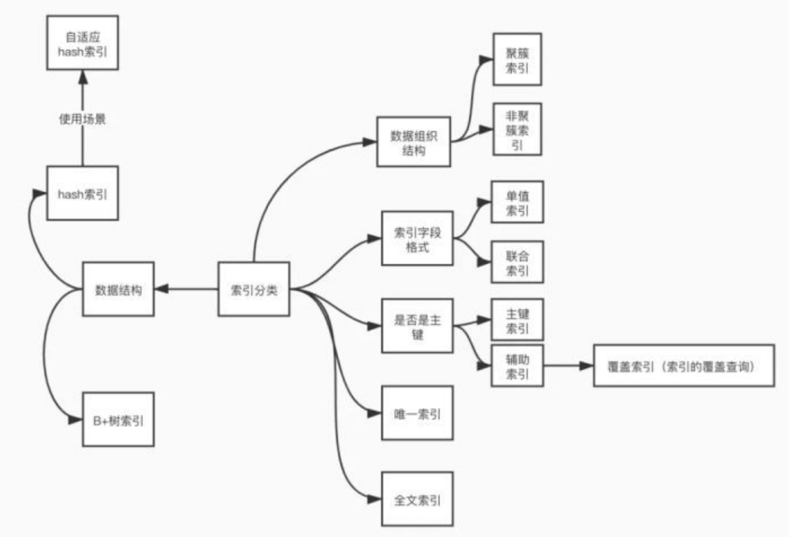

###### 不同索引对比

1. 按数据结构

|      | Full Text 全文索引                                           | Hash 索引                                                    | B+Tree 索引                                                  | RTree 索引 |
| ---- | ------------------------------------------------------------ | ------------------------------------------------------------ | ------------------------------------------------------------ | ---------- |
| 特性 | 1. 只有 CHAR / VARCHAR / TEXT 列上创建索引<br />2. 只在 MyISAM 上支持 | 1. 底层是 Hash 表<br />2. 对于精准查询（即 ' = '、' IN ' 条件）非常高效<br />3. 无法通过索引做区间查询，只能扫描全表<br />4. 范围查询、排序、组合索引效率不高 | 1. InnoDB 引擎默认索引模型<br/>2. 一种多路平衡二叉树的结构，每次查询都是从根节点root开始，遍历子节点<br/>3. 可以存储整行数据（存储整行数据的叫主键索引，也叫聚簇索引），也可以是主键值（存储主键值叫非主键索引，也叫非聚簇索引）<br />4. InnoDB 默认对主键建立聚簇索引 | 很少使用   |

2. 按实际使用

|      | 聚簇索引                                                     | 非聚簇索引         | 单列索引           | 组合索引               | 普通索引           | 主键索引               | 唯一索引       | 全文索引                       |
| ---- | ------------------------------------------------------------ | ------------------ | ------------------ | ---------------------- | ------------------ | ---------------------- | -------------- | ------------------------------ |
|      | 索引与数据存放在一起，找到索引的同时也找到了数据             | 索引与数据分开存放 | 索引创建在单个列上 | 在多个字段上创建的索引 | 普通列构成，无限制 | 使用主键键值建立的索引 | 与普通索引类似 | 用大文本对象的列构建的索引     |
|      | 唯一性，一张表只有一个                                       |                    |                    | 列值的组合必须唯一     | 值可重复           | 值必须唯一             | 值必须唯一     | 对文本的内容进行分词，进行搜索 |
|      | 聚簇索引默认是主键；如果表中没有定义主键，InnoDB 会选择一个非空唯一索引代替 |                    |                    | 不能有空值             | 允许有空值         | 不能有空值             | 允许有空值     |                                |

##### 13. 事务

> 事务就是逻辑上的一组 SQL 语句操作，组成这组操作的各个 SQL 语句，执行时要么全部成功，要么全部失败。
>
> 一个事务是一个完整的业务逻辑单元，不可再分；事务通常由**多条 DML 语句联合完成**，和事务相关的语句只有 DML 语句（insert、delete、update）。

###### 特性 ACID

- Atomicity：原子性，事务是最小的工作单元，不可再分；

- Consistency：一致性，事务必须保证多条语句同时完成或同时失败；

- Isolation：隔离性，事务 A 与事务 B 之间具有隔离；

- Durability：持久性，事务一旦被提交，就会被持久化到硬盘中。

###### 隔离级别

- 第一级别：读未提交 read uncommitted：我方可以读取对方事务**提交之前**的数据；

- 第二级别：读已提交 read committed：我方可以读取对方事务**提交之后**的数据；

- 第三级别：可重复读 repeated read：我方不可读取对方事务提交之后的数据；

- 第四级别：序列化读（串行化读）serialization：事务不能并发。

###### 并发问题

- 脏读：事务 A 可以读取事务 B 更新之后、提交之前的数据；

- 不可重复读：事务 B 在事务 A 多次读取统一数据的过程中，对该数据进行更新并提交，导致事务 A 的读取结果不一致，**重点在于修改**；

- 幻读：事务 B 在事务 A 读取数据期间插入相同搜索条件的新数据，导致事务 A 再次按照原先条件进行读取时，发现了事务 B 新插入的数据，**重点在于新增或删除**；

|          | 脏读 | 不可重复读 | 幻读 |
| -------- | ---- | ---------- | ---- |
| 读未提交 | T    | T          | T    |
| 读已提交 | N    | T          | T    |
| 可重复读 | N    | N          | T    |
| 序列化   | N    | N          | N    |

##### 14. 锁

锁的主要作用是管理共享资源的并发访问，用于实现事务的隔离性

锁的类型：共享锁（读锁）、独占锁（写锁）

锁的粒度：

1. 表级锁（开销小，并发性低），通常在服务器层实现；
2. 行级锁（开销大，并发性高），只会在存储引擎层面进行实现
3. 阻塞和死锁

## DAY03 SQL 优化

##### 1. MySQL 存储引擎

MyISAM VS InnoDB

|          | MyISAM                                                       | InnoDB                                                       |
| -------- | ------------------------------------------------------------ | ------------------------------------------------------------ |
| 概念     | MySQL 管理系统的默认存储引擎（MySQL 5.5 版本以前）           | 新版本 MySQL 中，InnoDB 引擎由于其对事物参照完整性（即对外键的支持）以及更高的并发性等优点，开始逐步的取代 MyISAM 引擎 |
| 特性     | 1. 不支持事务<br />2. 表级锁定：更新时锁定整张表<br />3. 读写互相堵塞<br />4. 只缓存索引，不缓存数据<br />5. 读取速度较快，占用资源较少<br />6. 不支持外键约束，支持全文索引<br /> | 1. 支持事务的四个级别 ACID<br />2. 行级锁定<br />3. 读写阻塞与事务隔离级别相关<br />4. 高效的缓存特性：缓存索引和数据<br />5. 整张表与主键组成一棵平衡树<br />6. 所有二级索引都会保存主键信息<br />7. 支持分区，表空间<br />8. 支持外键约束，不支持全文索引<br />9. 对硬件资源要求较高 |
| 使用场景 | 1. 不需要事务支持的业务<br />2. 以读为主的业务，读写都频繁的不适合，读多或写多都适合<br/>3. 并发访问低的业务（纯读、纯写高并发也可以）<br/>4. 数据修改相对较少的业务（阻塞问题)<br/>6. 对数据一致性要求高的业务<br/>7. 硬件资源较差的机器<br/>小结：单一对数据库的操作都可以使用 MyISAM 引擎<br/> | 1. 需要事务支持的业务<br />2. 高并发的业务<br />3. 数据读写与更新较频繁的（如微博）<br />4. 数据一致性要求较高的（如充值转账）<br />5. 硬件设备内存较大，利用 InnoDB 较好的缓存能力提高内存使用率，尽可能的较少磁盘的 I/O |

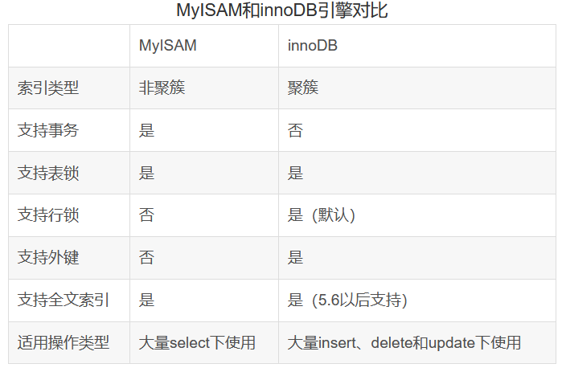

- MyISAM：MySQL 插件式存储引擎，是在 Web、数据仓储和其他应用环境下最常使用的存储引擎之一；
- InnoDB：用于**事务处理**应用程序，具有众多特性 ，包括 ACID 事务支持（原子性/一致性/隔离性/持久性）；
- BDB：可替代 InnoDB 的事务引擎，支持 COMMIT、ROLLBACK 和其他事务特性；
- MEMORY：所有数据保存在 RAM (Random Access Memory) 随机访问存储器中，在需要快速查找引用和其他类似数据的环境下，可提供极快的访问；
- Merge：允许 MySQL DBA 或开发人员将一系列等同的 MyISAM 表以逻辑方式组合在一起，并作为1个对象引用它们，对于诸如数据仓储等 VLDB 环境十分适合；
- Archive：为大量很少引用的历史、归档、或安全审计信息的存储和检索提供了完美的解决方案；
- Federated：能够将多个分离的MySQL服务器链接起来，从多个物理服务器创建一个逻辑数据库。十分适合于 分布式环境或数据集市环境。

存储引擎相关命令：

```mysql
#查看当前默认引擎
SHOW VARIABLES LIKE 'default_storage_engine';

#查看指定表的当前引擎
SHOW TABLE STATUS 
WHERE NAME = 'employees';

# 修改mysql默认的数据库引擎
-- 打开配置文件 my.ini，将 “default-storage-engine = MYISAM” 改为想设定的，然后重启。

#查看MySQL支持的引擎有哪些
SHOW ENGINES;
```

##### 2. 执行计划 EXPLAIN 

> 在 SQL 语句前增加 EXPLAIN 关键字，MySQL 会在查询上设置一个标记，模拟 MySQL 优化器来执行 SQL 语句。执行查询时，会返回执行计划的信息，并不执行这条SQL。
>
> 注意：如果 FROM 中包含子查询，仍会执行该子查询，将结果放入临时表中。
>
> EXPLAIN 可以用来分析 SQL 语句和表结构的性能瓶颈。通过 EXPLAIN 的结果，可以了解表的查询顺序、数据查询的操作类型、哪些索引可以被命中、哪些索引实际会命中、每张表有多少行记录被查询等信息。

##### 3. MySQL Slow Log 分析工具

> MySQL 中的 Slow Log 分析工具是用来记录执行时间较长（超过 long_query_time 秒，默认是 10s ）的 SQL 的一种日志工具。      

五款常用工具对比：

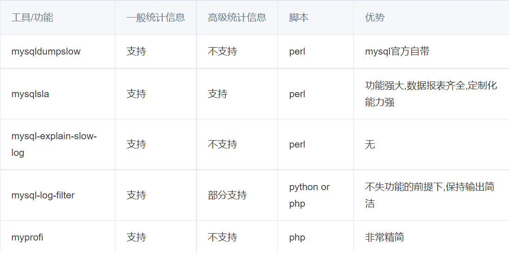

##### 4. 优化方式

- 设计合理的数据表结构：适当的数据冗余
- 建立有效的数据库索引
- 编写简洁高效的 SQL 语句

###### 表结构设计原则

1. 选择合适的数据类型，尽量使用定长
2. 使用 ENUM 而不是 VARCHAR，ENUM 非常快速紧凑，实际上其保存的是 TINYINT，外表显示为字符串
3. 不使用无法加索引的类型作关键字段，如 TEXT
4. 为避免连表查询，可以适当数据冗余，如姓名、邮箱这些不易更改的数据
5. 选择合适的引擎
6. 最好每张表都建立 AUTO_INCREMENT 字段，建立合适的索引
7. 最好每个字段都设定 DEFAULT 值

###### 索引建立原则

1. 一般针对数据分散的关键字段建立索引，如 ID
2. 字段唯一，不可为 NULL
3. 对大数据量表建立聚集索引
4. 尽量使用短索引，一般对 INT、CHAR、VARCHAR、DATE、TIME 等字段建立索引
5. 需要的时候建立联合索引
6. 谨慎建立 UNIQUE 类型的索引
7. 大文本字段不建立索引，若要检索大文本字段，考虑全文索引
8. 频繁更新的字段不适合建立索引
9. 主键自动建立唯一索引
10. 系统默认为由唯一性约束的字段建立索引
11. 经常作为查询条件在 WHERE 或 ORDER BY 语句中出现的列要建立索引
12. 查询中与其他表关联的字段，外键关系建立索引
13. 高并发条件下倾向组合索引
14. 用于聚合函数的列，比如使用了 MAX(column) 或者 COUNT(column) 时的 column 就需要建立索引
15. 对于只是做查询用的数据库索引越多越好，但对于在线实时系统建议控制在5个以内
16. DECIMAL 类型字段不要单独建立为索引，但覆盖索引可以包含这些字段
17. 只有建立索引以后，表内的行才按照特地的顺序存储，按照需要可以是 ASC 或 DESC 方式
18. 如果索引由多个字段组成将最用来查询过滤的字段放在前面，可能会有更好的性能

###### 索引失效的情况

1. 组合索引中不能有列的值为 NULL，否则这一列对组合索引就是无效的
2. 在一个 SELECT 语句中，索引只能使用一次，如果在 WHERE 中使用了，就不在 ORDER BY 中使用了
3. LIKE 操作（模糊查询中），‘ %aaa% ’ 不会使用索引（失效），但是 ‘ aaa% ’ 可以使用索引
4. 在索引的列上使用表达式或函数会使索引失效，将在每个行上进行运算
5. 在查询条件中使用不等于，包括 < 、> 、!= 会导致索引失效
6. 在查询条件中使用 IS NULL 或者 IS NOT NULL 会导致索引失效
7. 字符串不加单引号会导致索引失效
8. 在查询条件中使用 OR 连接多个条件会导致索引失效，除非 OR 连接的每个条件都加上锁，这时应该改为两次查询，用 UNION 连接起来

###### 编写高效 SQL

1. 能够快速缩小结果集的 WHERE 条件写在前面，如果有恒量条件，也尽量放在前面
2. 尽量避免使用 GROUP BY、DISTINCT 、OR、IN 等语句的使用
3. 避免使用联表查询和子查询，因为将使执行效率大大下降
4. 能够使用索引的字段尽量进行有效的合理排列，如果使用了联合索引，注意提取字段的前后顺序
5. 针对索引字段使用 >, >=, =, <, <=, IF NULL 和 BETWEEN 将会使用索引，如果对某个索引字段进行 LIKE 查询，使用 LIKE ‘%abc%’  不能使用索引，使用 LIKE ‘abc%’ 将能够使用索引
6. 如果在 SQL 里使用了 MySQL 部分自带函数，索引将失效，同时将无法使用 MySQL 的 Query Cache，比如 LEFT(), SUBSTR(), TO_DAYS(),  DATE_FORMAT() 等，
7. 使用了 OR 或 IN，索引也将失效
8. 使用 EXPLAIN 语句来帮助改进 SQL 语句
9. 不要在 WHERE 子句中的 “ = ” 左边进行算术或表达式运算，系统可能无法正确使用索引
10. 尽量不要在 WHERE 条件中使用函数，否则将不能使用索引
11. 避免使用 SELECT *，只取需要的字段
12. 对于大数据量的查询，尽量避免在 SQL 语句中使用 ORDER BY 字句，避免 额外开销，替代为使用 ADO.NET （一组用于和数据源进行交互的面向对象 类库）来实现
13. 只关心需要的表和满足条件的数据
14. 适当使用临时表或表变量
15. 对于连续的数值，使用 BETWEEN 代替 IN
16. WHERE 子句中尽量不要使用 CASE 条件
17. 尽量不用触发器，特别是在大数据表上
18. 更新触发器如果不是所有情况下都需要触发，应根据业务需要加上必要判断条件
19. 使用 UNION ALL 操作代替 OR 操作，注意此时查询条件可以使用聚集索引，如果是非聚集索引将起到相反的结果
20. 当只要一行数据时使用 LIMIT 1
21. 尽可能使用 NOT NULL 填充数据库
22. 拆分大的 DELETE 或 INSERT 语句
23. 批量提交 SQL 语句

###### SQL 其他技巧

1. 使用 EXPLAIN / DESC 来分析 SQL 的执行情况

2. ```mysql
   #查看当前 MySQL 服务器线程执行情况，是否锁表，查看相应的SQL语句
   SHOW PROCESSLIST;
   
   #查看系统变量及其值
   SHOW VARIABLES;
   
   #查看服务器的状态信息
   SHOW STATUS;
   
   #查看MySQL支持的引擎
   SHOW ENGINES;
   
   #查看表结构
   DESC TABLE table_name;
   
   #查看表索引
   SHOW INDEX FROM table_name;
   ```

3. 设置 my.cnf 中的 long-query-time 和 log-slow-queries 能够记录服务器哪些 SQL 执行速度比较慢

4. 使用 LOAD DATA 导入数据比 INSERT INTO 快多了

5. SELECT COUNT(*) FROM table_name 在 InnoDB 中将会扫描全表，MyISAM 中则效率很高

##### 5. 开窗函数（分析函数）

> 开窗函数对一组值进行操作，不像普通聚合函数需要使用 GROUP BY 子句对数据进行分组，能够在同一行中同时返回基础行的列和聚合列

语法形式：

```mysql
window_function_name(expression) 
OVER (
    [partition_defintion] 	-- 分区定义
    [order_definition]		-- 顺序定义
    [frame_definition]		-- 帧定义
) 
```

分类：

- 排序开窗函数

1. ROW_NUMBER() OVER()：对相等的值不进行区分，相等的值排名不同，序号从1到 n 为连续值。
2. RANK() OVER()：相等的值排名相同，但若有相等的值，则序号从1到 n 不连续（如果两个人都排在第3名，则没有第4名）。
3. DENSE_RANK() OVER()：相等的值排名相同，但序号从1到 n 连续（如果有两个人都排在第1名，则排在第2名（假设仅有1个第二名）的人是第3个人）。
4. NTILE( n ) OVER()：可以看作是把有序的数据集合平均分配到指定的数量 n 的桶中，将桶号分配给每一行，排序对应的数字为桶号，序号从1到 n 连续。如果不能平均分配，则较小桶号的桶分配额外的行，并且各个桶中能放的数据条数最多相差1。

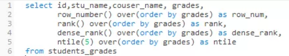

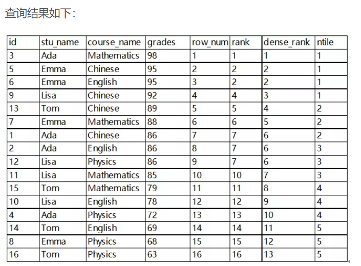

- 聚合开窗函数

  > 已知聚合函数对一组值执行计算，并返回单一的值，如 SUM()，COUNT()，MAX()，MIN()，AVG() 等，常与 GROUP BY 子句连用。除了 COUNT 以外，聚合函数忽略空值。
  >
  > 但有时候一组数据只返回一组值是不能满足需求的，如我们想知道各个地区、各个班或各个学科的前几名。这时候需要每一组返回多个值。

  开窗函数与聚合函数一样，也是对行集组进行聚合计算，但是它不像普通聚合函数那样每组只返回一个值，开窗函数可以为每组返回多个值。